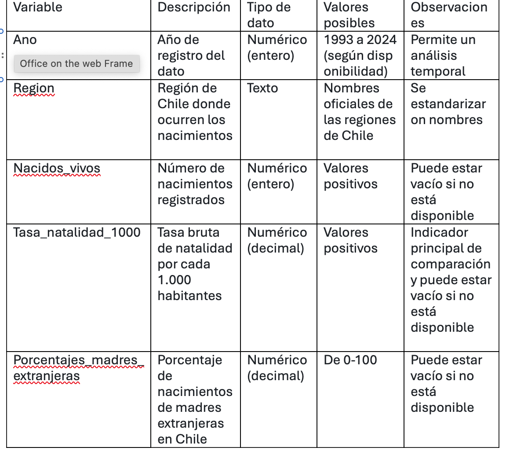

**Fuente de datos:**  
Los datos utilizados en la base provienen de publicaciones oficiales del Instituto Nacional de Estadísticas (INE). Específicamente de los siguientes documentos: 
Anuario de Estadísticas Vitales 
Síntesis de Estadísticas Vitales 
Informe y presentaciones institucionales sobre fecundidad  
Estadísticas vitales: cifras provisionales  
Estos documentos tienen cifras sobre nacimientos, tasa de natalidad, características de la madre e información territorial.  
Además, se utilizó un tablero de visualización de datos publicado por el Departamento de Estadísticas e Información de la Salud (DEIS). Para obtener datos de los años 2004 y 2005 que no fueron hallados en los anuarios del INE.  
 
**Metodología de la construcción de la base:** 
La base de datos fue construida de forma manual a partir de la revisión y extracción de datos desde diferentes documentos oficiales del INE y del DEIS. Este proceso incluyó: 
1. Identificación de tablas relevantes en anuarios y reportes.  
2. Extracción manual de datos (por años y región).  
3. Estandarización de nombres de variables y regiones.  
4. Homogenización de los formatos numéricos, es decir, uso del punto decimal. 
5. Consolidación de la información en un archivo único en formato CSV.  
 
**Alcance de los datos:**
Cobertura geográfica: a nivel nacional y regional en Chile.  
Cobertura temporal: principalmente de los años 1993 a 2024.  
Unidad de análisis: hay dos variables que destacan en la investigación, los años y las regiones. 
Esta base de datos permite observar diferencias territoriales en la natalidad y el peso relativo de las madres extranjeras en los nacimientos. Sin embargo, como solo existen los porcentajes de madres extranjeras de 2024 a 2014, se hará otra base de datos con los de sexo del bebé, según los años.  
 
**Característica de los datos:** 
Datos cuantitativos. 
Datos estructurados. (Si bien, las cifras fueron obtenidas de documentos, estos posteriormente fueron organizados de manera definida en un Excel).  
Datos discretos (nacidos vivos) 
Datos continuos (tasa de natalidad y porcentaje de madres extranjeras).  
Datos secundarios (a partir de fuentes oficiales). 
Variables comparables en el tiempo (con limitaciones en ciertos años). 
Estructura tabular (formato CSV). 
Base de datos construida a partir de varias fuentes. 
 
**Otras observaciones  sobre la base:** 
No todos los años cuentan con información disponible de madres extranjeras.  
Algunas variables no están disponibles a nivel regional la tasa de natalidad, lo que limita la comparación total. Por ejemplo, de 2003 a 1993 la región de Los Ríos y Ñuble no estaban constituídas. Por otra parte, esos mismos años la región de Tarapacá incluye a Arica y Parinacota.  
En el año 2017, se estimó de forma muy meticulosa la tasa de natalidad cada 1.000 habitantes, ya que estaba incierta en un gráfico de barras que no tenía todos los dígitos puestos, sino que iba de cinco en cinco.   
Diccionario de datos: tabla con el nombre de cada variable, su descripción, tipo de dato, valores posibles y observaciones editoriales: 

