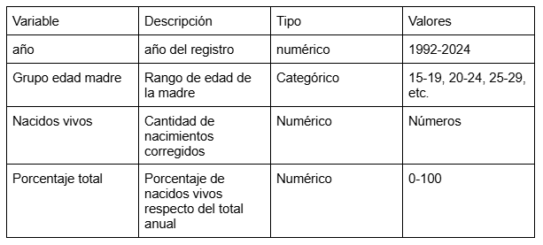

## 3. Ficha técnica y diccionario de datos

**Fuente de los datos**
Los datos fueron obtenidos del Instituto Nacional de Estadísticas (INE), específicamente de las series históricas de estadísticas vitales (1992-2024).

**Metodología de construcción**
Trabajé con los nacimientos corregidos por año, debido a que consideran ajustes por subregistro.
En primer lugar, saqué los valores de nacimiento corregidos desde la base original mediante el cruce de la variable “año”, asegurando la correspondencia entre registros.
Luego, se organizó la información según edad de la madre, agrupando los datos en rangos etarios (15-19, 20-24, 25-29, 30-34, 35-39, 40-44, 45-49), con el fin de facilitar el análisis.
Finalmente, se calculó el porcentaje del total de nacidos vivos por año para cada grupo etario.

**Alcance de los datos**
La base abarca el período entre 1992 y 2024 a nivel nacional de Chile.

**Características de los datos**
Se trata de una base de datos cuantitativa, estructurada en formato longitudinal, que combina variables categóricas (grupo etario de la madre) y numéricas (nacidos vivos y porcentaje del total).

**Observaciones**
Para los años 2023 y 2024 no fue posible calcular el porcentaje del total de nacidos vivos, debido a que la fuente del INE no disponía de los nacimientos corregidos para dichos años al momento de la elaboración de la base.
Por esto, fueron incluidos de manera parcial.

**Diccionario de datos:**

