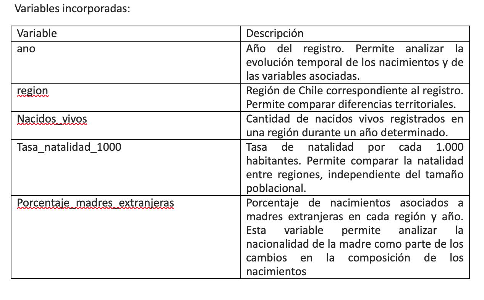

**Ficha técnica de la base de datos**

Nombre: base_datos_infante.csv 

Tema: Evolución de la natalidad, diferencias territoriales y nacionalidad de la madre en Chile.  

Descripción general:
La base de datos reúne información anual sobre natalidad en Chile, organizada por año y región. Contiene indicadores relacionados con nacidos_vivos, tasas de natalidad y porcentajes de madres extranjeras, lo que permite observar cómo ha cambiado el fenómeno tanto temporal como territorialmente.  
La base de datos fue utilizada para analizar a evolución de la natalidad en Chile y explorar diferencias territoriales vinculadas a la nacionalidad de la madre. A partir de estos datos se construyeron distintas visualizaciones enfocadas en la evolución de la tasa de natalidad por región y en las regiones con mayor porcentaje de madres extranjeras.

Período analizado: 1993 a 2022. 

Observaciones: 
La base de datos combina indicadores de distinta naturaleza y escala. Por ejempllo, nacidos_vivos son cantidades absolutas, mientras que tasa_natalidad_1000 y porcentajes_madres_extranjeras son indicadores porcentuales o tasa con decimales.  
Por otro lado, se observó que en los años 2024 y 2023 había datos no registrados, por lo tanto, se optó por analizar desde el 2022. Con el fin de tener un análisis más preciso.  

