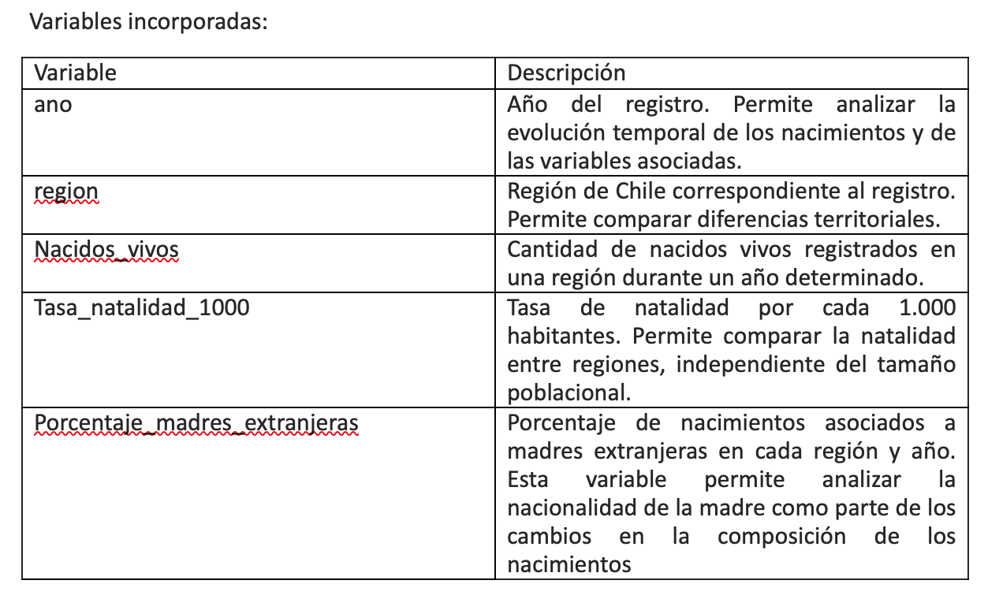

**Readme: documentación del proceso de visualización** 

Esta entrega individual trabaja con una base de datos sobre nacimientos en Chile, enfocada específicamente en la relación entre territorio, tasa de natalidad y nacionalidad de la madre. El objetivo fue construir una visualización que permitiera observar en qué regiones aumentó más el porcentaje de madres extranjeras y cómo esta variable ayuda a complejizar la baja general de la natalidad en el país.  

La visualización final busca responder una dimensión específica de la hipótesis general del proyecto: la disminución de la natalidad no ocurre de manera homogénea en todo Chile, sino que presenta diferencias territoriales y cambios en la composición de las madres. En este caso, se observó especialmente la presencia de madres extranjeras por región.  

 

Base de datos utilizada: 

La base utilizada fue Base de datos infante.csv. Esta contiene información organizada por año y región, con variables relacionadas con nacimientos, tasa de natalidad y porcentaje de madres extranjeras. Esta base fue seleccionada porque permite analizar tres dimensiones centrales para la investigación.  

En primer lugar, permite observar la evolución temporal de los nacimientos mediante la variable “ano”. Segundo, permite comparar diferencias territoriales a través de la variable "region". Por último, incorpora la variable "porcentajes_madres_extranejras", que permite analizar la nacionalidad de la madre como parte de la transformación de los patrones reproductivos.  

 

Proceso realizado en Python: 

El trabajo se realizó en Google Colab, utilizando Python, pandas y Altair. En primer lugar, se instalaron las librerías necesarias para trabajar con visualización y exportación de gráficos. Luego se importaron las librerías principales: Pandas para procesar la base de datos y Altair para construir la visualización.  

Cabe señalar que para este proceso se utilizó la ayuda de inteligencia artificial y apoyo de una persona que posee mayor experiencia, con el finde entrar en lleno en los códigos, no obstante, el desarrollo del proyecto fue entendido.  

En una primera etapa se cargó la base en formato CSV usando pandas. Para comprobar que el archivo se había cargado de manera correcta, se revisaron las primeras filas con df.head(), los nombres de las columnas con df.columns, la estructura general de la base con df.info() y un resumen estadístico con df.describe().  

Después se revisaron los años disponibles mediante df["ano"].unique() y las regiones presentes en la base con df[“region].unique(). Este paso permitió entender la cobertura temporal y territorial de la base antes de hacer cualquier análisis.  

Luego se revisaron los años 2023 y 2024, debido a que en la base aparecían valores iguales a 0 en algunas variables. Para evitar que esos datos incompletos distorsionaran el análisis, se decidió trabajar solo con los años hasta 2022. Es por esa razón, que se creó una nueva base llamada df_limpia, que contiene únicamente los registros con año menor o igual a 2022. Esta decisión fue importante porque permitió trabajar con una base más consistente y evitar conclusiones erróneas a partir de registros incompletos.  

Antes de construir la visualización final, se realizaron distintos análisis exploratorios. Primero, se agruparon los nacimientos por año usando groupby, con el objetivo de observar la evolución general de los nacidos vivos en el tiempo. Esto permitió mirar si existía una disminución general de nacimientos. Luego se calculó la tasa promedio de natalidad por año, lo que permitió observar si la caída también se reflejaba en la tasa de natalidad y no solo en el número absoluto de nacidos vivos. Luego se continuó calculando la tasa promedio de natalidad por año, lo que permitió observar si la caída también se reflejaba en la tasa de natalidad y no solo en el número absoluto de nacidos vivos.  

Después, se analizó el porcentaje de madres extranjeras por año y región. Para esto se usaron agrupaciones y ordenamientos que permitieron identificar qué regiones presentaban mayores valores en esta variable. A su vez, se quiso comparar las variables entre años y entre regiones. También, se construyeron rankings por región, ordenando los datos según el porcentaje de madres extranjeras. Esto permitió identificar patrones territoriales, especialmente la concentración de mayores porcentajes en regiones del norte del país.  

Finalmente, se calcularon cambios entre el primer año disponible y el último año trabajado. Para esto se crearon tablas separadas con valores iniciales y finales de tasa de natalidad y porcentaje de madres extranjeras. Luego estas tablas fueron unidas mediante merge, generando una tabla resumen llamada “resumen_regiones”. Esta tabla permitió comparar, por región, el cambio en la tasa de natalidad y el cambio en el porcentaje de madres extranjeras.  

Antes de terminar el proceso, se realizó la descarga de exportación de los archivos en formato htlm y jpg.  

Durante el proceso se tomaron varias decisiones metodológicas. La primera fue trabajar con datos hasta el 2022, ya que los años posteriores presentaban valores incompletos o iguales a cero. Esta decisión buscó evitar que la visualización entregara una lectura distorsionada. La segunda decisión fue usar variables agregadas por región, porque la hipótesis del proyecto apunta a mostrar que la baja de la natalidad no ocurre de manera similar en todo el territorio. La tercera decisión fue enfocar la visualización final en el porcentaje de madres extranjeras, esta variable fue seleccionada porque permite observar cambios en la composición de los nacimientos y no solo en la cantidad de nacidos vivos. Por último, se decidió usar un gráfico de barras horizontal, ya que permite mostrar de manera clara un ranking regional. Respecto a este, inicialmente se exploró un gráfico de dispersión, pero se descartó porque los nombres de las regiones se sobreponían y dificultaba la lectura. El gráfico de barras resultó más adecuado para comunicar de forma simple qué regiones concentraban los mayores valores.  

Por otra parte, se realizó un gráfico de barras horizontal que muestra las cinco regiones con mayor promedio de madres extranjeras durante el período analizado.  Para construirlo, primero se agrupó la base por región y se calculó el promedio del porcentaje de madres extranjeras. Luego se ordenaron las regiones de mayor a menor y se seleccionaron las cinco primeras. El gráfico permite observar que Tarapacá, Antofagasta y Arica y Parinacota, la Región Metropolitana y Atacama aparecen como las regiones con mayores promedios de madres extranjeras.  

Con respecto a los últimos gráficos, el primero es de líneas y es respecto a la evolución de la tasa de natalidad por región en Chile. Para construirlo, se utilizaron las variables ano, región y tasa_natalidad_100. En este gráfico, el eje X corresponde a los años, y el eje Y a la tasa de natalidad por cada 1.000 habitantes y casa línea representa una región. Esta visualización permitió observar la evolución temporal de la natalidad y comparar el comportamiento regional a lo largo del periodo trabajado.  

Para construirla se usó alt.Chart(df_lineas), que indica que la visualización se hará a partir de la base limpia df_lineas. Luego, con mark_line(point=True) se definió que sería un gráfico de líneas con puntos, lo que permite ver la evolución de cada región año a año. 

Dentro de encode() se asignaron las variables principales: ano al eje X, tasa_natalidad_100 al eje Y y region al color. Esto permitió que cada región apareciera como una línea distinta. También se usó tooltip para que al pasar el cursor sobre el gráfico se mostrara el año, la región y la tasa de natalidad exacta. 

El segundo gráfico es de barras horizontales que muestra el cambio en la tasa de natalidad por región entre el primer año disponible y el último año del periodo trabajado. Para esto, se crearon dos tablas: una con la tasa de natalidad inicial y otra con la tasa de natalidad final. Luego, ambas tablas fueron unidas mediante merge según la variable region. A partir de esto se creó una nueva variable llamada cambio_tasa, calculada como la diferencia entre la tasa final y la tasa inicial. Este gráfico permitió identificar qué regiones tuvieron una mayor caída en la tasa de natalidad y las variaciones distintas que tuvo cada una. 

El tercer y último gráfico se enfocó en la proporción de nacimientos según origen de la madre por región. Para construirlo, se ultilizó la variable porcentajes_madres_extranjeras, que indica qué porcentaje de los nacimientos corresponde a madres extranjeras. A partir de esta variable se creó una nueva columna llamada porcentajes_madres_no_extranjeras, calculada como 100 menos el pocentaje de madres extranjeras. Esto permitió representar el total de nacimientos de cada región como un 100%, dividido entre madres extranjeras y madres chilenas o no extranjeras. 

Para este gráfico, la base fue transformada a formato largo mediante la función melt, lo que permitió que Altair construyera un gráfico de barras al 100%. En el código se usó region en el eje Y, porcentaje en el eje X y origen_madre como color, para distinguir visualmente a los dos grupos. Además, se incorporó stack=”normalize”, que hace que todas las barras tengan el mismo largo y representan al 100% de los nacimientos de cada región. 

También se agregó un selector de año mediante binding_select y param, para que la visualización pudiera cambiar según el año seleccionado y no quedara limitada a un solo periodo. Finalmente, las regiones fueron ordenadas de norte a sur, con el objetivo de facilitar una lectura territorial del fenómeno. 

Esta visualización permite complementar la hipótesis general del proyecto, debido a que muestra que la baja de natalidad no solo debe analizarse como una disminución general de nacimientos, sino también como un fenómeno con diferencias territoriales y cambios en la composición de las madres.  

Preguntas que puede responder la visualización: 

¿Qué regiones presentan el mayor promedio de madres extranjeras? 

¿Existe una concentración territorial de madres extranjeras en ciertas zonas del país? 

¿Qué regiones del país destacan en la composición migratoria de los nacimientos? 

¿Cómo ayuda la nacionalidad de la madre a complejizar el análisis de la natalidad? 
¿La presencia de madres extranjeras se distribuye de manera homogénea en Chile o se concentra en ciertos territorios? 

