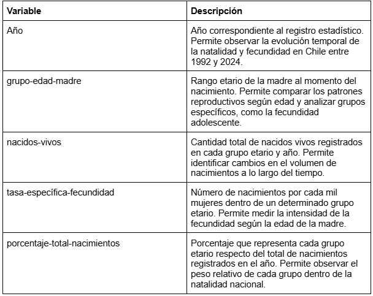

## **Ficha técnica de la base de datos**

**Nombre**: Farah Jadue

**Nombre base de datos**: jadue_database_limpia(2).csv

**Tema**: Evolución de la fecundidad adolescente en Chile entre 1992 y 2024

**Descrpción general**:

La base de datos reúne información anual sobre natalidad y fecundidad en Chile. Contiene indicadores que permiten observar cambios en los patrones reproductivos según grupo etario de la madre.

Para esta entrega, la base de datos utilizada para construir la visualización sobre la evolución de la tasa específica de fecundidad adolescente en Chile entre 1992 y 2024, enfocándose en el grupo etario de 15 a 19 años.

**Período analizado**: 1992 a 2024.

**Variables incorporadas**:

**Observaciones**: 

Para la visualización final se filtró únicamente el grupo etario de 15 a 19 años, correspondiente a fecundidad adolescente.
La columna de tasa específica de fecundidad fue procesada en Python para convertir sus valores desde formato texto a formato numérico, permitiendo su visualización mediante Altair en Google Colab.
