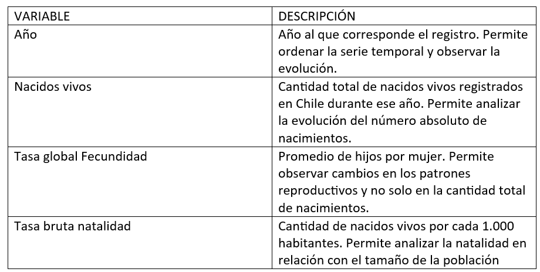

## **Ficha técnica de la base de datos**

**Nombre:** valenzuela_database_limpia.csv 

**Tema:** Evolución nacional de la natalidad en Chile entre 1992 y 2024. 

**Descripción general**

La base de datos reúne información anual sobre la natalidad en Chile. Contiene indicadores que permiten observar cómo ha cambiado el fenómeno a nivel nacional durante las últimas décadas. 

Para esta entrega, la base fue utilizada para construir tres visualizaciones sobre la caída de la natalidad: una sobre nacidos vivos, otra sobre tasa global de fecundidad y una comparación entre 1992 y 2024 de los principales indicadores de natalidad.  

**Período analizado:** 1992 a 2024. 

**Variables incorporadas** 

**Observaciones** 

Los indicadores incluidos tienen escalas distintas. Por ejemplo, Nacidos vivos corresponde a cantidades absolutas, mientras que Tasa global Fecundidad y Tasa bruta natalidad tienen decimales. Por esta razón, en el tercer gráfico se decidió separar los indicadores en paneles distintos y usar escalas independientes, para evitar comparaciones visuales confusas.