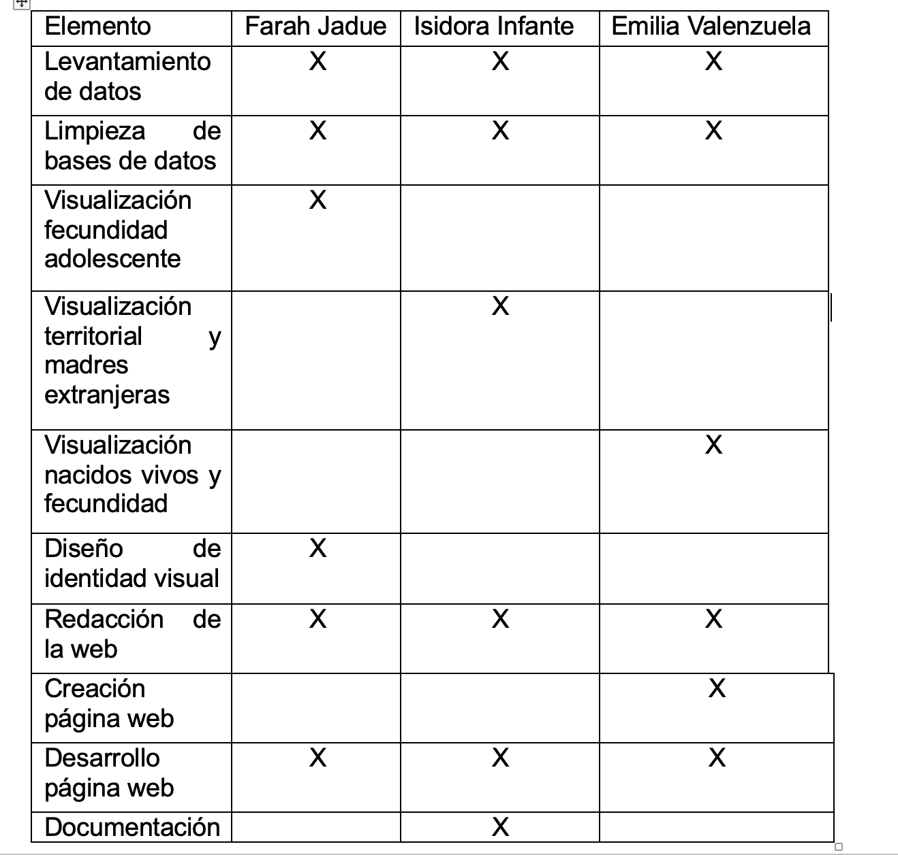

**Readme**

**Chile nace menos: las nuevas formas de maternidad**

**Resumen del reportaje:**

Durante las últimas décadas, Chile ha experimentado una disminución sostenida en la cantidad de nacimientos, alcanzado en los últimos años cifras históricamente bajas. Sin embargo, este fenómeno no puede explicarse únicamente como una baja demográfica. Detrás de la caída de la natalidad existen transformaciones sociales, culturales y territoriales, que han modificado la forma en que las personas proyectan la maternidad y la conformación de familias.

A partir del análisis de datos provenientes del Instituto Nacional de Estadísticas (INE) y del Departamento de Estadísticas e Información de Salud (DEIS), este reportaje explora cómo han cambiado los patrones reproductivos en Chile entre 1992 y 2024. La investigación busca ir más allá de la pregunta sobre cuántos niños nacen y concentrarse en quiénes tienen hijos, cuándo los tienen y cómo estas dinámicas varían según distintos contextos sociales y territoriales. 

Por ello, se analizaron distintos indicadores demográficos, entre ellos la evolución de los nacidos vivos, la tasa global de fecundidad, la fecundidad adolescente, las diferencias regionales en la natalidad y la nacionalidad de la madre. El conjunto de estos elementos permitió construir una mirada más amplia sobre el fenómeno, entendiendo la baja natalidad como una expresión de cambios profundos en la sociedad chilena. 

Asimismo, el reportaje incorpora el contexto del debate público que actualmente existe en torno a la baja natalidad en el país. A partir de la presentación del Plan Chile Renace y de la creciente preocupación de las instituciones por este fenómeno, la investigación busca vincular la evidencia obtenida mediante el análisis de datos con las discusiones que hoy forman parte de la agenda pública. De esta manera, las visualizaciones no solo permiten describir una tendencia demográfica, sino también comprender por qué la disminución de la natalidad representa un desafío para las políticas públicas, el envejecimiento de la población, los sistemas de cuidados y la planificación del desarrollo futuro del país.  

La historia final propone que Chile no solo está experimentando una disminución de nacimientos, sino también una transformación de las formas de maternidad, la reducción de la maternidad adolescente, la disminución del promedio de hijos por mujer y las diferencias observadas entre regiones, muestran que los cambios demográficos están estrechamente relacionados con transformaciones culturales, económicas y sociales, ocurridas durante las últimas décadas. 

**Hipótesis inicial:**

La caída de la natalidad en Chile entre 1992 y 2024, no responde solo a una disminución general de nacimientos, sino a una transformación del calendario reproductivo: las mujeres tienen menos hijos, los tienen a mayor edad y la maternidad adolescente disminuye significativamente. Este fenómeno podría presentar variaciones, según territorio y características de la madre, como su nacionalidad, lo que será explorado como una dimensión complementaria del análisis.

**Evolución de la hipótesis:**

La hipótesis inicial funcionó como un punto de partida para la investigación y permitió orientar el trabajo de recopilación limpieza y análisis de datos .A medida que avanzó el proyecto, los resultados obtenidos confirmaron que la disminución de la natalidad no puede explicarse únicamente como una reducción general de nacimientos, sino que está acompañada por transformaciones relevantes en los patrones reproductivos de la población. A su vez, en un principio teníamos la idea de hablar solamente del concepto de la caída de la natalidad, pero a  la hora de hacer la base de datos y recopilar información, nos dimos cuenta de que habían otros comportamientos que incidían en esta disminución. 

Los datos mostraron una disminución sostenida de la tasa global de fecundidad y una reducción significativa de la maternidad adolescente, elementos que respaldan la idea de una modificación en el calendario reproductivo de las mujeres chilenas. Estos hallazgos permitieron observar que el fenómeno estudiado no consiste solamente en que nacen menos niños, sino también en que las decisiones relacionadas con la maternidad se han transformado de manera importante durante las últimas décadas.

Asimismo, el análisis territorial permitió identificar diferencias relevantes entre regiones. Algunas zonas presentaron comportamientos distintos respecto de la tendencia nacional, lo que llevó a incorporar una dimensión geográfica en la interpretación de los resultados. De igual forma, el análisis de la nacionalidad de la madre permitió identificar la relevancia que adquieren los procesos migratorios en determinadas regiones del país, especialmente en el norte de Chile.

Durante el desarrollo del proyecto, la hipótesis evolucionó desde una mirada centrada exclusivamente en el calendario reproductivo hacia una comprensión más amplia del fenómeno. Los resultados obtenidos mostraron que la baja natalidad no puede entenderse únicamente desde variables demográficas, sino también desde cambios sociales, culturales y territoriales que influyen en la forma en que las personas construyen sus proyectos familiares.

En consecuencia, la historia final se enfocó en demostrar que la disminución de la natalidad constituye una manifestación visible de transformaciones más profundas en la sociedad chilena. Más que una simple caída en la cantidad de nacimientos, los datos revelan cambios en las formas de maternidad en las trayectorias de vida y en las dinámicas demográficas que caracterizan al país en la actualidad. 

**Principales hallazgos:**

A partir del análisis realizado, se identificaron cuatro hallazgos principales:
1.	La tasa global de fecundidad disminuyó de manera sostenida durante el período analizado, reflejando una reducción en el promedio de hijos por mujer.
2.	La fecundidad adolescente experimentó una caída significativa, convirtiéndose en una de las transformaciones más relevantes observadas en los datos.
3.	Existen diferencias territoriales importantes en la evolución de la natalidad, lo que demuestra que el fenómeno no se manifiesta de igual forma en todas las regiones del país.
4.	La nacionalidad de la madre constituye una variable relevante para comprender ciertas dinámicas demográficas regionales, particularmente en zonas del norte del país.

Estos hallazgos permitieron construir una narrativa centrada en las nuevas formas de maternidad y en los cambios que atraviesan actualmente a la sociedad chilena. 

**Tabla de autoría:** 

